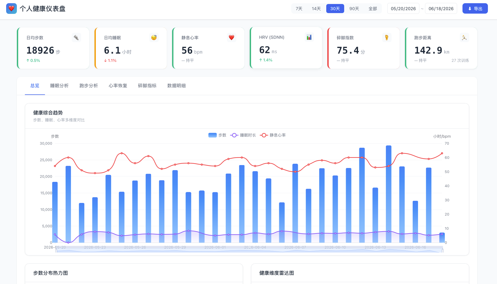
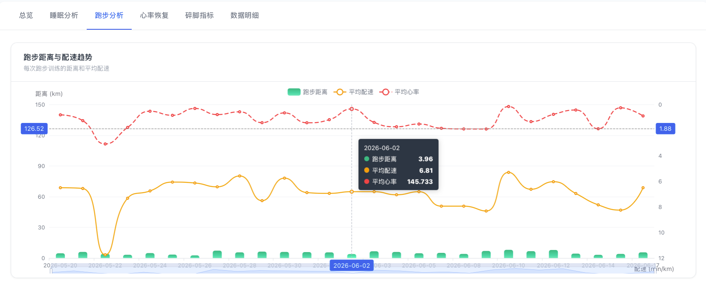
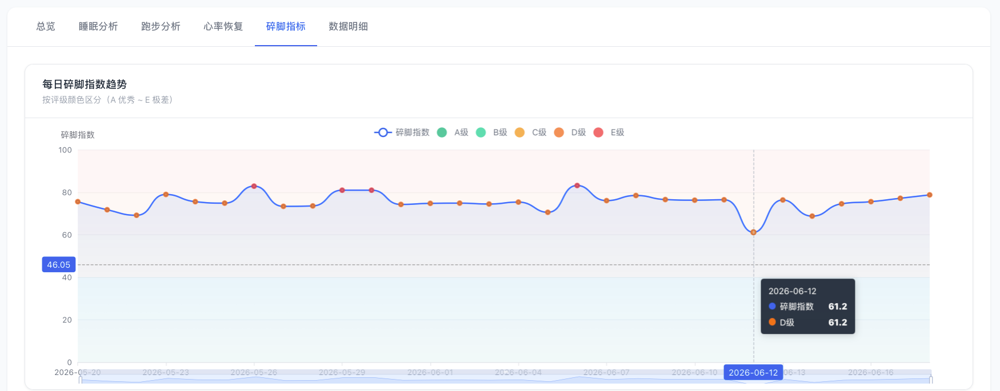

# Personal Health Dashboard / 个人健康仪表盘

> **Interactive health analytics dashboard for Apple Health data, featuring the proprietary Fragmentation Index.**
> **基于 Apple Health 数据的交互式健康分析仪表盘，独创"碎脚指标"量化步行效率。**

---

<div align="center">

[](https://www.python.org/)
[](LICENSE)
[](#)
[](https://echarts.apache.org/)

**Pure Python standard library — zero third-party dependencies.**
**纯 Python 标准库实现 — 零第三方依赖。**

</div>

<div align="center">

Created by [JeffenCheung](https://github.com/JeffenCheung) · 光合而不同，人生自有别

</div>

---

## 🌟 Highlights / 核心亮点

### 🦶 Fragmentation Index / 碎脚指标（独创）

The **Fragmentation Index** is a novel metric that quantifies how "fragmented" your daily walking is. Just like stop-and-go traffic wastes fuel, fragmented walking wastes energy. The same 10,000 steps can feel very different depending on whether they come from a continuous walk or dozens of short trips to the water cooler.

**碎脚指标**是本项目独创的健康指标，量化日常行走的"碎片化程度"。就像堵车时一脚油门一脚刹车更费油，碎片化的行走也更耗能。同样是一万步，连续散步和频繁起身打水的疲惫感截然不同。

| Index / 指数 | Grade / 评级 | Interpretation / 解读 |
|:---:|:---:|:---|
| 0 – 20 | **A** | Efficient, mostly continuous walking / 高效连续行走 |
| 21 – 40 | **B** | Mildly fragmented / 轻度碎片化 |
| 41 – 60 | **C** | Moderately fragmented / 中度碎片化 |
| 61 – 80 | **D** | Highly fragmented, significant energy waste / 高度碎片化 |
| 81 – 100 | **E** | Extremely fragmented / 极度碎片化 |

> 💡 **Why it matters / 为什么重要**: Studies show that intermittent walking requires up to **2.9× more energy** than continuous walking for the same distance. A high fragmentation index correlates with subjective fatigue and lower movement efficiency.
>
> 研究表明，间歇性行走比连续行走多消耗高达 **2.9 倍**的能量。碎脚指数高的日子，主观疲劳感更强，运动效率更低。

#### 🔬 Scientific Basis / 科学依据

The Fragmentation Index is grounded in peer-reviewed research published in *Proceedings of the Royal Society B: Biological Sciences* (2024):

**碎脚指标的理论依据来源于 2024 年发表于《英国皇家学会学报 B-生物科学期刊》的同行评审研究：**

| Finding / 发现 | Detail / 详情 | Impact / 影响 |
|:---|:---|:---|
| **间歇能耗增幅 / Intermittent Energy Cost** | 间歇步行能量消耗可达连续步行的 **2.9 倍** | 每走 300 米，停下再走的能耗约为连续走完的 3 倍 |
| **启动过渡能耗 / Start-up Transition Cost** | 10 秒步行氧气消耗是 240 秒的 **3.4 倍** | 行走段越短，启动能耗占比越高 |
| **肌腱弹性回收 / Tendon Elastic Recovery** | 跟腱在着地时储存弹性势能，蹬地时释放 | 连续运动可利用肌腱"弹簧效应"节能 |

**两大能耗机制 / Two Energy-Wasting Mechanisms:**

1. **启动过渡成本 (Start-up Transition Cost)**
   - 人体从静止启动时，能量消耗显著高于稳态运动
   - 每次启动都需要额外的肌肉激活能量
   - 行走段越短，启动过渡期占比越大，额外能耗越多

2. **肌腱弹性损失 (Tendon Elastic Energy Loss)**
   - 跟腱（Achilles Tendon）类似弹簧，着地时拉长储存弹性势能
   - 蹬地时回缩释放能量，减少肌肉收缩能耗
   - 连续运动中，肌腱可高效回收利用弹性势能
   - 停止后，刚回收的能量散失，无法用于下一次运动

> **来源 / Source:** 逛博物馆真的吸人精气？你的感觉是对的，博物馆就是会更累！果壳 (Guokr), 2024. 基于: *Proceedings of the Royal Society B: Biological Sciences*, October 2024.
>
> [[果壳报道]](https://mp.weixin.qq.com/s?__biz=MTg1MjI3MzY2MQ==&mid=2652365000&idx=1&sn=cedd5bbb3f4568e22536ddb7a1fe8605) · [[原始论文]](https://royalsocietypublishing.org/toc/rspb/current)

See [Fragmentation Index Algorithm](docs/fragmentation-index.md) for the full mathematical formulation.
完整算法原理请参见 [碎脚指标算法说明](docs/fragmentation-index.md)。

---

## 🖼️ Dashboard Preview / 仪表盘预览

<div align="center">

### 📋 Overview / 总览页


### 🏃 Running Analysis / 跑步分析


### 🦶 Fragmentation Index / 碎脚指标


</div>

---

### 📊 Interactive Dashboard / 交互式仪表盘

Built with **ECharts 5.x**, the dashboard supports filtering, zooming, and drill-down across multiple time dimensions (7 / 14 / 30 / 90 days). No server required — everything runs in a single HTML file.

基于 **ECharts 5.x** 构建，支持日期筛选、图表缩放、数据下钻。多时间维度自由切换（7/14/30/90天）。无需服务器 — 单文件 HTML 开箱即用。

### 😴 Sleep Analysis / 睡眠深度分析

Multi-stage sleep tracking (deep / REM / core), sleep efficiency, sleep midpoint circadian rhythm, and correlation with resting heart rate.

多阶段睡眠追踪（深睡 / REM / 核心睡眠）、睡眠效率、睡眠中点昼夜节律、与静息心率的关联分析。

### 🏃 Running Gait Analysis / 跑步步态分析

Distance, pace, heart rate zones, ground contact time, stride length, cadence, and running power — all from Apple Watch workout data.

距离、配速、心率区间、触地时间、步幅、步频、跑步功率 — 全部来自 Apple Watch 运动数据。

### 💓 Heart Rate Recovery / 心率恢复监控

Resting heart rate trends, HRV (Heart Rate Variability), and recovery status monitoring with anomaly alerts.

静息心率趋势、HRV 心率变异性、恢复状态监控与异常告警。

### 📱 Feishu (Lark) Integration / 飞书集成

Push daily health summaries to Feishu messages, sync workouts and sleep to Feishu Calendar, and generate weekly reports in Feishu Docs.

每日健康摘要推送至飞书消息，运动和睡眠记录同步到飞书日历，周报自动生成飞书文档。

---

## 🚀 Quick Start / 快速开始

### Prerequisites / 环境要求

- Python 3.10 or higher (standard library only — no pip install needed)
- Apple Health export data (`export.xml`)
- A modern web browser (for the dashboard)

- Python 3.10 及以上（仅标准库 — 无需 pip install）
- Apple Health 导出数据（`export.xml`）
- 现代浏览器（查看仪表盘）

### Installation / 安装

```bash
git clone https://github.com/yourusername/personal-health-dashboard.git
cd personal-health-dashboard
```

**That's it.** No `pip install` required.
**完成。** 无需执行 `pip install`。

### Data Preparation / 数据准备

1. Export your health data from iPhone: **Health app → Profile → Export All Health Data**
2. Unzip the export and locate `export.xml`
3. Place it in a directory of your choice

1. 从 iPhone 导出健康数据：**健康 App → 个人头像 → 导出所有健康数据**
2. 解压导出文件，找到 `export.xml`
3. 放到任意目录

### Usage / 使用方法

#### Step 1: Process raw data / 第一步：处理原始数据

```bash
# If you have a pre-built ETL script (recommended)
# 如果你有 ETL 处理脚本（推荐）
python src/health_etl.py --input path/to/export.xml --output data/processed/
```

> **Note**: The ETL script is optional. You can also use any Apple Health XML to CSV converter. The dashboard expects CSV files in `data/processed/` (see [docs/data-format.md](docs/data-format.md)).
>
> **注意**：ETL 脚本是可选的。你也可以使用任何 Apple Health XML 转 CSV 工具。仪表盘期望 CSV 文件位于 `data/processed/` 目录（格式见 [docs/data-format.md](docs/data-format.md)）。

#### Step 2: Calculate Fragmentation Index / 第二步：计算碎脚指标

```bash
python src/calc_fragmentation.py \
  --input path/to/export.xml \
  --output data/processed/fragmentation.csv
```

Or from a pre-processed CSV / 或者从已处理的 CSV 计算：

```bash
python src/calc_fragmentation.py \
  --input data/processed/step_records.csv \
  --output data/processed/fragmentation.csv \
  --days 90
```

#### Step 3: Generate the dashboard / 第三步：生成仪表盘

```bash
python src/generate_dashboard.py \
  --data data/processed/ \
  --output reports/
```

Open `reports/interactive_health_dashboard.html` in your browser.
在浏览器中打开 `reports/interactive_health_dashboard.html`。

#### Step 4 (Optional): Feishu sync / 第四步（可选）：飞书同步

Copy and edit the config file:
复制并编辑配置文件：

```bash
cp config/feishu_config.example.json config/feishu.json
# Edit with your webhook URLs and app credentials
# 填入你的 webhook 地址和应用凭证
```

```bash
python src/feishu_sync.py \
  --config config/feishu.json \
  --dashboard reports/interactive_health_dashboard.html \
  --mode daily
```

---

## 📐 How the Fragmentation Index Works / 碎脚指标算法原理

### Core Idea / 核心思想

The index is a weighted composite of three sub-metrics, each scaled 0–1:

碎脚指数由三个子指标加权合成，每个子指标范围为 0–1：

```
Fragmentation Index =
    Fragmentation Ratio × 40
  + Bout Frequency × 30
  + Gap Coefficient × 30
```

| Component / 组成 | Weight / 权重 | What it measures / 衡量内容 |
|:---|:---:|:---|
| Fragmentation Ratio / 碎片化占比 | 40% | Short bouts (<3 min) as proportion of all bouts / 短碎片段占总行走段的比例 |
| Bout Frequency / 段频率 | 30% | How many walking bouts per day (capped at 20) / 每日行走段数量（20段为上限） |
| Gap Coefficient / 间隔系数 | 30% | Inverse of average bout duration / 平均段时长的倒数 |

### Walk Bout Detection / 行走段识别

Step records are merged into "walking bouts" when the gap between consecutive records is ≤ 5 minutes. This distinguishes a single continuous walk from many separate short walks.

将间隔不超过 5 分钟的步数记录合并为一个"行走段"，从而区分一次连续散步和许多次零散的短距离行走。

### Energy Loss Estimation / 能量损耗估算

```
Estimated extra energy cost = total_steps × fragmentation_index / 100 × 0.3 kcal
```

The 0.3 kcal/step coefficient is a rough estimate of the additional energy cost of fragmented vs. continuous walking.

0.3 kcal/步 是碎片化行走相对连续行走的额外能耗估算系数。

Full details: [docs/fragmentation-index.md](docs/fragmentation-index.md)
完整说明：[docs/fragmentation-index.md](docs/fragmentation-index.md)

---

## 🎯 Dashboard Modules / 功能模块

### Overview Tab / 总览页
- Key metric cards with trend indicators / 关键指标卡片 + 趋势箭头
- Composite health score / 健康综合评分
- 7-day calendar heatmap / 7 天日历热力图

### Sleep Tab / 睡眠分析
- Sleep duration trend (bar chart) / 睡眠时长趋势（柱状图）
- Sleep stage distribution (stacked area) / 睡眠阶段分布（堆叠面积图）
- Sleep midpoint scatter / 睡眠中点散点图
- Sleep efficiency vs deep sleep correlation / 睡眠效率与深睡占比关联

### Running Tab / 跑步分析
- Distance / duration trend / 距离与时长趋势
- Heart rate zone distribution / 心率区间分布
- Gait analysis: ground contact time, stride length, cadence / 步态分析：触地时间、步幅、步频
- Workout detail table / 运动记录明细表

### Heart Rate Tab / 心率恢复
- Resting heart rate trend / 静息心率趋势
- HRV SDNN trend / HRV 心率变异性趋势
- Heart rate & sleep correlation / 心率与睡眠关联分析

### Fragmentation Tab / 碎脚指标
- Daily fragmentation index trend / 每日碎脚指数趋势
- Grade distribution / 评级分布
- Walk bout duration histogram / 行走段时长分布直方图
- Fragmentation vs fatigue correlation (with manual logging) / 碎脚指数与疲劳感关联（需手动记录）

---

## 🛠️ Tech Stack / 技术栈

| Layer / 层 | Technology / 技术 | Notes / 说明 |
|:---|:---|:---|
| Backend / 后端 | Python 3.10+ (standard library only) | Zero pip dependencies / 零第三方依赖 |
| Frontend / 前端 | HTML5 + CSS3 + Vanilla JS + ECharts 5.x | Single-file output, CDN-loaded / 单文件输出，CDN 加载 |
| Data Processing / 数据处理 | Streaming XML parsing (iterparse) | Memory efficient for large exports / 内存高效，支持大文件 |
| Output Format / 输出格式 | Self-contained HTML | Open anywhere, no server needed / 随处可打开，无需服务器 |
| Integration / 集成 | Feishu Open Platform API / 飞书开放平台 | Webhook + App authentication / Webhook + 应用认证 |

---

## 📱 Platform Compatibility / 兼容平台

| Platform / 平台 | Status / 状态 | Notes / 说明 |
|:---|:---:|:---|
| Apple Health (iOS) | ✅ Full Support / 完全支持 | Primary data source / 主要数据源 |
| Apple Watch | ✅ Full Support / 完全支持 | Preferred for granular data / 细粒度数据优先 |
| Android Health Connect | ⚠️ Not tested / 未测试 | May work with format conversion / 格式转换后可能可用 |
| Fitbit / Garmin | ⚠️ Not tested / 未测试 | Requires data format adaptation / 需适配数据格式 |
| Desktop browsers (Chrome/Safari/Firefox) | ✅ Full Support / 完全支持 | Dashboard viewing / 查看仪表盘 |
| Mobile browsers | ✅ Full Support / 完全支持 | Responsive design / 响应式设计 |

---

## 📁 Project Structure / 项目结构

```
personal-health-dashboard/
├── README.md                    # This file / 本文件
├── LICENSE                      # MIT License
├── requirements.txt             # Dependencies (none!) / 依赖清单（为空！）
├── .gitignore
├── assets/                      # Demo screenshots / 仪表盘截图
│   ├── dashboard_overview.png       # Overview tab / 总览页
│   ├── dashboard_running.png        # Running tab / 跑步分析
│   └── dashboard_fragmentation.png  # Fragmentation tab / 碎脚指标
├── src/                         # Source code / 源代码
│   ├── calc_fragmentation.py    # Fragmentation Index calculator / 碎脚指标计算
│   ├── generate_dashboard.py    # Dashboard generator / 仪表盘生成器
│   └── feishu_sync.py           # Feishu integration / 飞书集成
├── skill/                       # TRAE Skill definition / TRAE 技能定义
│   ├── SKILL.md
│   └── references/
│       ├── fragmentation-index.md
│       ├── dashboard-design.md
│       ├── health-etl-spec.md
│       ├── feishu-integration.md
│       └── test-cases.md
├── docs/                        # Documentation / 文档
│   └── fragmentation-index.md   # Fragmentation Index deep dive / 碎脚指标深度解析
├── config/                      # Configuration templates / 配置模板
│   └── feishu_config.example.json
└── examples/                    # Examples / 示例
```

---

## 🤝 Contributing / 贡献指南

Contributions are welcome! Here's how you can help:

欢迎贡献！以下是你可以参与的方式：

1. **Fork** the repository / **Fork** 本仓库
2. Create a **feature branch** / 创建功能分支：`git checkout -b feature/amazing-feature`
3. **Commit** your changes / 提交更改：`git commit -m 'Add amazing feature'`
4. **Push** to the branch / 推送分支：`git push origin feature/amazing-feature`
5. Open a **Pull Request** / 发起 **Pull Request**

### Code Standards / 代码规范

- Python: Follow PEP 8, use type hints, standard library only
- Python：遵循 PEP 8，使用类型提示，仅使用标准库
- JavaScript: Vanilla JS only, no frameworks
- JavaScript：仅使用原生 JS，不引入框架
- Documentation: Bilingual (English + Chinese) is preferred
- 文档：优先使用中英双语

### Ideas for Contribution / 贡献方向

- [ ] Android Health Connect data adapter / Android Health Connect 数据适配器
- [ ] Garmin / Fitbit data import / Garmin / Fitbit 数据导入
- [ ] Additional health metrics / 更多健康指标
- [ ] Dark mode for dashboard / 仪表盘暗色模式
- [ ] More language support / 更多语言支持
- [ ] WeChat / DingTalk integration / 微信 / 钉钉集成

---

## ⚠️ Disclaimer / 免责声明

> **This tool is for personal health trend reference only and is NOT intended for medical diagnosis, treatment, or prescription.**
>
> **本工具仅供个人健康趋势参考，不用于医疗诊断、治疗或处方。**
>
> The Fragmentation Index and all other metrics computed by this tool are derived from consumer-grade wearable data and have not been validated for clinical use. Always consult a qualified healthcare professional for medical advice. Do not make health decisions based solely on the output of this tool.
>
> 本工具计算的碎脚指标及所有其他指标均来自消费级可穿戴设备数据，未经过临床验证。如有医疗需求，请咨询专业医疗人员。请勿仅凭本工具的输出做出健康决策。
>
> Apple Health and Apple Watch are trademarks of Apple Inc. This project is not affiliated with or endorsed by Apple Inc.
>
> Apple Health 和 Apple Watch 是 Apple Inc. 的商标。本项目与 Apple Inc. 无关联，也未获得其认可。

---

## 👤 About the Author / 关于作者

**English:**
Created and maintained by [JeffenCheung](https://github.com/JeffenCheung).

> *"Harmonious growth through diversity — each life finds its own unique path."*

**中文：**
由 [JeffenCheung](https://github.com/JeffenCheung) 创建并维护。

> 光合而不同，人生自有别。

Follow me on [GitHub](https://github.com/JeffenCheung) for more open source projects.

---

## 📄 License / 许可证

[MIT License](LICENSE) — feel free to use, modify, and distribute.

[MIT 许可证](LICENSE) — 可自由使用、修改和分发。

---

<div align="center">

**If you find this project useful, please give it a ⭐ star!**
**如果这个项目对你有帮助，请给它一个 ⭐ star！**

Made with ❤️ for health data enthusiasts.
为健康数据爱好者用心打造。

</div>
